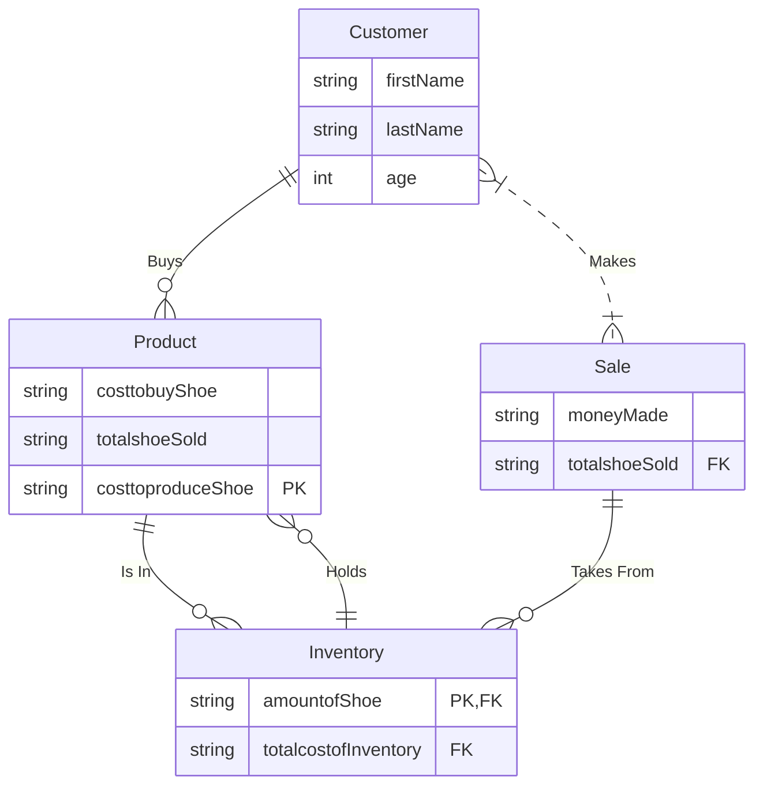

The Customer is what gives the Nike store the ability to exist. Without any demand the store would have nobody to sell their product to.  
The Inventory holds all of the stores products, and makes it easier to keep track of all the products they have sold. Also makes it easier to see what the store needs to restock on.  
Sales are very importaint for a company without sales the store would go bankrupt.  
Without any products the store would have method of making money. Products can also create hype around the store and help generate more customers.

